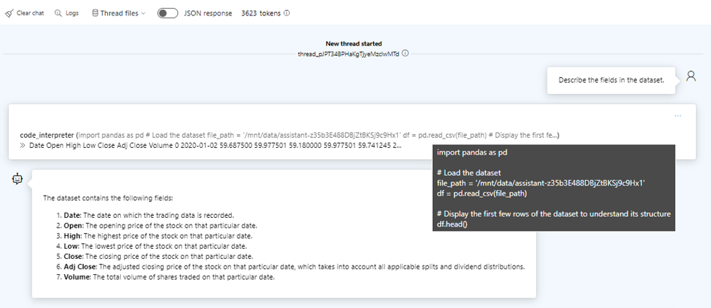
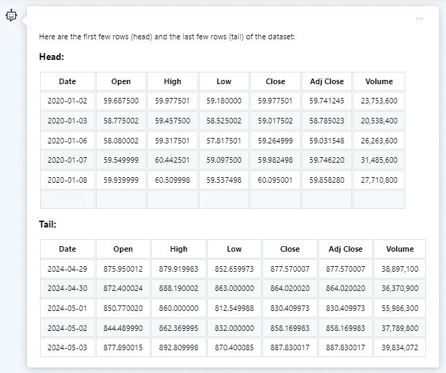
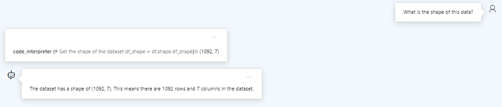
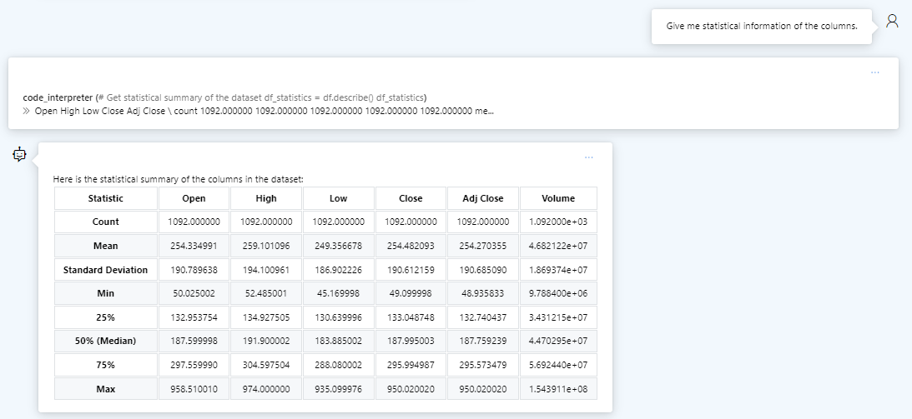
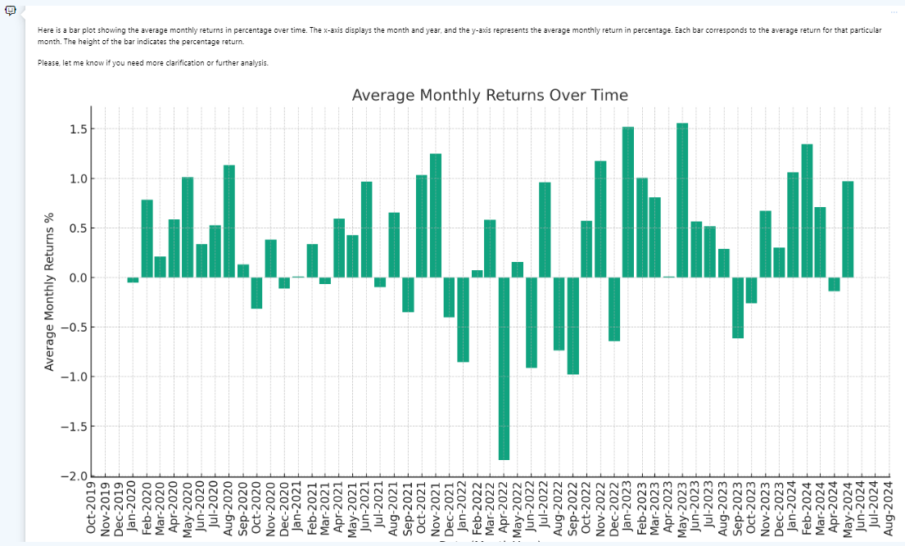
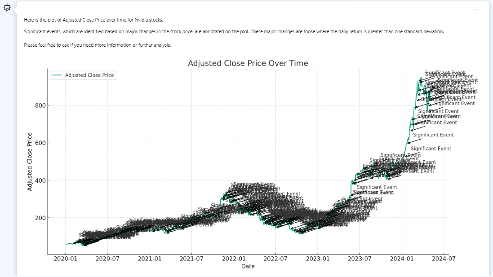
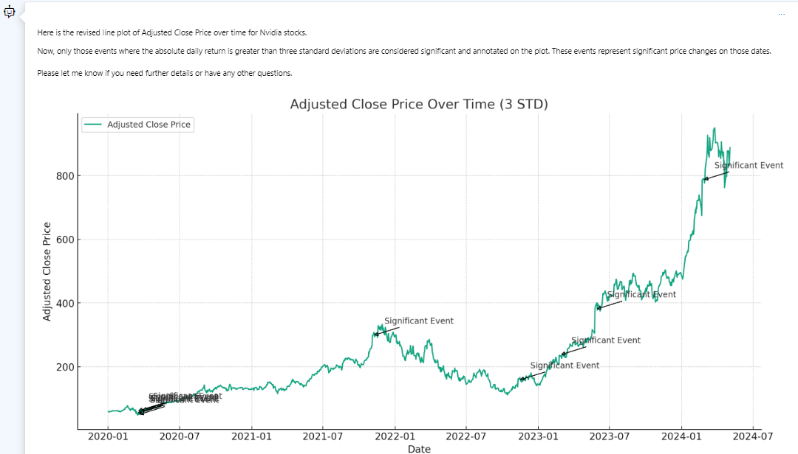

# Using GPT-4o for Data Analysis
Using Azure AI Assistants (Code Intepreter) for Data Science
  Let's see if we can automate data analysis on the Nvidia stock price data.
  I will be using the <b>gpt-4-32k</b> model deployed in my Azure AI Hub.
 
 
For this example, I am going to use the NVIDIA stock price dataset.
 You can download it  and upload the CSV file into the Assistants playground.
 
  Below is the system instruction (prompt) that I set up in the Assistants playground.
  `You are an expert Business Intelligence Analyst who will be fielding questions about stock price of Nvidia.`
 
## Exploratory Analysis
As a data analyst, typically we want to have a quick overview of the dataset we are dealing with.
 So let’s explore this dataset first. You can try the following prompts:
* Describe the fields in the dataset.
* Show head and tail of this dataset.
* What is the shape of this data?
* Give me statistical information of the columns.

 

 

 

 
  Observe how the LLM has converted your prompts from natural language to python code, and execute the python code to generate the results, and then provide summarized response back in natural language.
 
  From the responses above, we get a sense of the dataset on hand, for example, the stock price and trading volumne from 02/Jan/2020 to 03/May/2024, as well as basic statistics across this period.
 
## Data Visualization
A picture (or visual) speaks a thousand words. Let's see how we can automate data visualization tasks.
### Monthly Returns
Assuming you buy Nvidia's stock at the start of the month and sell it at the end of the month, how much you will earn?
 Let’s use this prompt to generate a bar plot to visualize this.
 
`Provide this: Bar Plot of Monthly Returns in percentage over time, 
Date column should include this Month- Year instead of dates day by day.`

  We can oberve that there is a positive stock returns on most months. If you had held this stock over the entire period, you would have likely accumulated a decent gain :)
 
## Line Plot With Trending Events
  Now, we want to know how the stock price has changed over time and see if we can correlate key events to these changes.
 
`Create a plot of adjusted close price over time with annotations for significant events. 
The dataset contains the 'Date' and 'Adj Close' columns. 
Identify significant events based on major changes in the stock price and annotate them on the plot.`
  Here's the initial line plot. However, the model seems to have made an incorrect assumption, and basically marked out all the changes are significant.

  Let's correct its assumption and only consider those changes that are more 3 standard deviations.
 
`Please revise the line plot. Only those changes which are more than 3 standard deviations should be considered significant.`

 
 

